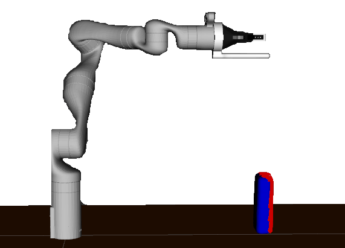

# Active Visuo-Haptic Object Shape Completion

This repository includes code for _Active Visuo-Haptic Object Shape Completion_.  
**Authors**: Lukas Rustler, Jens Lundell, Ville Kyrki and Matej Hoffmann  
**Maintainer**: Lukas Rustler, rustlluk@fel.cvut.cz  

 
<\p>

# Contents  
- [Licensing](#licensing)
- [Installation](#installation) 
- [Data](#data)
- [Repeating our experiments](#repeating-our-experiments)
- [Training the network](#training-the-network)
- [Running the simulation](#running-the-simulation)
- [Experiments running](#experiments) 
- [Evaluation](#evaluation)  
- [Baselines](#baselines)  
- [Real setup](#real-setup)  

## Licensing

This repository uses various repositories. See [LICENSE](LICENSE.txt) and the original repositories for licensing info:  
- [ODIO-URDF](https://github.com/hauptmech/odio_urdf)    
- [MuJoCo-ROS](https://github.com/JKBehrens/mujoco-ros)  
- [Kinova_Mujoco](https://github.com/JKBehrens/kinova_mujoco)  
- [V-HACD](https://github.com/kmammou/v-hacd)  
- [Point cloud segmentation](https://github.com/aalto-intelligent-robotics/point_cloud_segmentation)  
- [IGR](https://github.com/amosgropp/IGR)  
- [GPIS](https://github.com/marcospaul/GPIS)  
- [ros_kortex](https://github.com/Kinovarobotics/ros_kortex)  
- [Fast-Robust-ICP](https://github.com/yaoyx689/Fast-Robust-ICP)  
MuJoCo is a trademark of DeepMind (https://mujoco.org)

## Installation  

This repository is tested on Ubuntu 18.04 with ROS Melodic. With minor adjustments, it will run on ROS Kinetic (some functions regarding mainly planning will need to be manually added), but it will not run on other versions of ROS. It also needs UNIX based system, i.e., it will not work on Windows.  

### Docker  
Installation of all dependencies may be troublesome, and we recommend using the provided Docker image.   
- Install Docker from https://docs.docker.com/engine/install/  
- Install nvidia-docker from https://docs.nvidia.com/datacenter/cloud-native/container-toolkit/install-guide.html#docker  
  - for better utilization of the gpu
-  Pull the image `docker pull rustlluk/visuo-haptic-shape-completion:latest`  
  - Alternatively you can build your own image from [Dockerfile](Docker/Dockerfile)
  - Optionally, you can call `docker tag rustlluk/visuo-haptic-shape-completion:latest  <image_name>`, where `<image_name>` can be any name you want the image to have, to be more user-friendly for you  
- Other user defined name is `<container_name>`. It is used by other Docker commands, e.g., `docker start <container_name> && docker attach <container_name>` will run the container after you first do `docker run` (described later)

The are two possible (recommended) ways to link data from your computer:  
1. Link only data  
   - Run `docker run -it -p 6080:6080 --name <container_name> -v path_to_data_folder_on_your_pc:/root/act_vh_ws/src/shape_completinon/data --gpus all <image_name> /bin/bash`, where `<container_name>` is name of the container selected by you and `<image_name>` is either rustlluk/visuo-haptic-shape-completion:latest or a name selected by you with `docker tag`
   - This will link a data folder from your computer to the container and all data created in visuo-haptic experiments will be stored directly in your pc  
   - All code is stored inside the container and you can edit it in inside the contained (there are some editors installed and you can install your prefered one)
     - Be careful with PyCharm editor as it seems to kill VNC session. But maybe another version than we used may be working fine
   - To save changes made in the container, you just need to exit the container (CTRL+D or exit) and run `docker commit <container_name> <image_name>`  
2. Link the whole repository  
   - Get to some folder `cd path_to_the_folder` and clone this repository `git clone https://github.com/ctu-vras/visuo-haptic-shape-completion.git`  
   - run `docker run -it -p 6080:6080 --name <container_name> -v path_to_the_folder/visuo-haptic-shape-completion:/root/act_vh_ws/src/ --gpus all <image_name> /bin/bash`  
     - `<container_name>` and `<image_name>` have the same function as in Option 1. 
   - This way, all the code will be linked from your computer to the container. You can edit it on your computer, and all changes will be immediately transferred to the container
   - The repository is already built inside the container, and all should work immediately. However, if you occur some errors (or if you change some C++ files), you can rebuild the repository inside the container. Easilly run `cd /root/act_vh_ws` and `catkin build` 
   - With this methods, you will need to download meshes from https://drive.google.com/file/d/1KKg9DpzX_2IhxWZsIzGgwEh5kDoz6eCq/view?usp=sharing and put them into [kinova_mujoco/GT_meshes](kinova_mujoco/GT_meshes)

- After you `docker run` with either method you need to run `start-vnc-session.sh`  
  - it will run noVNC session inside the container
  - the vnc is needed for OpenGL software
- On your computer, open your favorite internet browser and connect to `localhost:6080`  
  - you can run the container on other computer and connect to `computer_ip:6080` or `computer_hostname:6080`  

| VNC Desktop Environment| RVIZ running in VNC |
| --- | --- | 
|  |  |

Tips and Tricks
- You can work entirely in the container over VNC---it contains a desktop environment with an internet browser, file manager etc. However, we usually use the container just as a screen and do everything in terminals on the host computer
  - you can open another terminal in the container with `docker exex -it <container_name>`
- Unfortunately, you can not copy-past from the host computer to the container.
- If you have only one screen and do not want to work inside the container, you can open it on a mobile phone just by connecting to the VNC in your phone's internet browser
- You can delete the container with `docker container rm <container_name>`
  - or delete all Docker resources with `docker system prune -a`
- It may happen that VNC stop to work. Just rerun `start-vnc-session.sh` again
- If you need `sudo` for every Docker command, get to the end of the installation notes in https://docs.docker.com/engine/install/
- GPIS reconstruction does not work in the Docker container by default because Matlab is needed, and we can not install Matlab without a license. You can install Matlab in the container by yourself (and [matlab_engine](https://www.mathworks.com/help/matlab/matlab-engine-for-python.html) for Python) to use GPIS.

### Manual installation  
If you have problems with some dependencies, check [Dockerfile](Docker/Dockerfile) where we installed everything   
- Setup a ROS workspace and clone this repository into _src_  
  - see http://wiki.ros.org/catkin/Tutorials/create_a_workspace
  - `cd your_catkin_ws`  
  - `git clone https://github.com/ctu-vras/visuo-haptic-shape-completion.git`  
  - `mv visuo-haptic-shape_completion src`  
- Install both python2 and python3
- Check dependencies for all repositories mentioned in [Licensing](#licensing)  
- We recommend to use Python environments. However, if you want to use them properly, you have to change some lines in the code:
  - Add lines to you `~/.bashrc`  
    - for example `alias shape_rec_p3='source your_python3_virtual_environment/bin/activate && source your_catkin_ws/devel/setup.bash'`
      - and the same for python2
    - Add `/bin/bash -i -c shape_rec_p3 &&` to the start of lines 187 and 208 in [main.py](shape_completion/scripts/main.py) and lines 409 and 428 in [evaluation_utils.py](shape_completion/src/shape_completion/evaluation_utils.py)
    - Add `/bin/bash -i -c shape_rec_p2 &&` to the start of lines 122, 125 and 145 in [do_experiments.py](shape_completion/scripts/do_experiments.py) and line 466 in [evaluation_utils.py](shape_completion/src/shape_completion/evaluation_utils.py)
- Install required libraries which may not be included in the previous  
  - `pip3 install trimesh open3d pymeshfix`  
  - `pip2 install trimesh open3d scikit-learn scipy`  
  - also [Python-PCL](https://github.com/strawlab/python-pcl) and [binvox_rw](https://github.com/dimatura/binvox-rw-py) are needed  
  - If there is any library needed and not mentioned above, installation through `pip` should be enough  
-  build the workspace  
  - `cd your_catkin_ws && catkin build`  
  - add `source your_catkin_ws/devel/setup.bash` to your `~/.bashrc` file  
- [V-HACD](v-hacd) and [Fast-Robust-ICP](Fast-Robust-ICP) contain built binaries and will work on most systems (with Ubuntu 18.04), but it may be required to be rebuild  
  - however, the pipeline expects this binaries to be in system path, so you have to add them, e.g.,  
    - `ln -s your_catkin_ws/src/v-hacd/build/linux2/test/testVHACD /usr/bin/testVHACD`  
    - `ln -s your_catkin_ws/src/Fast-Robust-ICP/build/FRICP /usr/bin/FRICP`  
  - In some cases change of permission will be needed as well  
    - `(sudo) chmod +x your_catkin_ws/src/Fast-Robust-ICP/build/FRICP`  
  - the same applies for [run_simulation.sh](shape_completion/scripts/run_simulation.sh)  
    -  `(sudo) chmod +x your_catkin_ws/src/shape_completion/scripts/run_simulation.sh`  
    - `ln -s your_catkin_ws/src/shape_completion/scripts/run_simulation.sh /usr/bin/run_simulation` 
  - install MuJoCo to `~/.mujoco`
    - We expect MuJoCo 2.10 to be installed. If you have other version, change [Findmujoco.cmake](mujoco-ros/mujoco_ros_control/cmake/Findmujoco.cmake) file in the mujoco-ros package

## Data
- Public dataset including point clouds and rosbags from both real and simulated setups can download from https://drive.google.com/drive/folders/14P1k0tFTt7TVIXP6vJ3z6zPe28TdV3Cf?usp=sharing
- Preptrained net for IGR is distributed with this repository in [exps](IGR/exps)  
  - the net is trained on YCB and grasp_database objects, which can be downloaded from https://drive.google.com/file/d/1KKg9DpzX_2IhxWZsIzGgwEh5kDoz6eCq/view?usp=sharing  
    - put them into [GT_meshes](kinova_mujoco/GT_meshes)  
- You can also download:  
  - _.pcd_ files collected during our experiments at https://drive.google.com/file/d/15Z97WHytDy4zyd45BygE8Msjj85E8LmZ/view?usp=sharing
    - put them to [pcd](shape_completion/data/pcd)  
  - _rosbags_ collected during our experiments at https://drive.google.com/file/d/1T8bvyk9G_6ScpjS2dvahnYRKd1d7NgLN/view?usp=sharing
    - put them to [rosbags](shape_completion/data/rosbags)  
  - _log files_ corresponding to our experiments at https://drive.google.com/file/d/12BC8AN6CGmG2_mHPaMAfQ8EphGIT80gz/view?usp=sharing
    - put them to [logs](shape_completion/data/logs)       

## Repeating our experiments
With these commands, you can repeat our experiments (or run your own just by changing the experiments file). We are using paths in the Docker environment, so if you installed the pipeline manually, change the paths accordingly. More details on each command are written later.  
- Run the experiments with `rosrun shape_completion do_experiments.py -s /root/act_vh_ws/src/shape_completinon/data/exps/simulation.json`  
  - this will run the simulation and make three repetitions with five touches on the whole dataset  
  - if you want to use other objects (or number of repetitions and touches), change the _simulation.json_ file  
- After the experiments are done, check `/root/act_vh_ws/src/shape_completion/data/logs` and locate the newest _.log_ file. It will be named with a timestamp. For easier use, you can rename it. We will refer it as _simulation.log_.
- Evaluate the results with `rosrun shape_completion evaluation_utils.py graphs_from_logs simulation.log`  
  - this will create graphs in `/root/act_vh_ws/src/shape_completion/data/figures` and _.npz_ files in `/root/act_vh_ws/src/shape_completion/data/offline_nn_vals`
- [Optionally] Reconstruct with baseline methods with `rosrun shape_completion baselines.py reconstruct_from_logs simulation.log`  
  - New meshes will be created in `/root/act_vh_ws/src/shape_completion/data/meshes`. Graphs and _.npz_ files will be created as well
- [Optionally] If you want meshes of a very different objects, you may need to retrain the network as described in [Training the network](#training-the-network)

## Training the network  
If you want to train your own model instead of using our pretrained model, follow the instructions:  
-  prepare the meshes you want to train on in .ply format  
- prepare split file similar to [no_ycb.json](IGR/code/splits/shape_completion/no_ycb.json)  
  - the structure is dictionary with key named as name of the dataset and value is another dictionary
  - the nested dictionary includes name of the object (without suffix) as key and array with string values denoting which rotations to use  
    - E.g., "0_z"  
    - only the possibilities in [no_ycb.json](IGR/code/splits/shape_completion/no_ycb.json) are available, if you want other rotations, you have to change [grasp_train.py](IGR/code/preprocess/grasp_train.py)  
- prepare training setup as in [shape_completion_setup.conf](IGR/code/shapespace/shape_completion_setup_train.conf)
- `cd path_to_the_ws/IGR/code`  
- `python3 preprocess/grasp_train.py -p path_to_folder_with_ply_meshes (can be kinova_mujoco/GT_meshes) -s path_to_your_split_file -c number_of_CPU_cores to use`  
  - this will create the training point clouds saved in IGR/data/npy
-  `python3 shapespace/train.py --expname your_desired_experiment_name --gpu number_of_the_gpu (0 if only one is available) --conf name_of_your_traininig_setup (relatively to shapespace directory) --split path_to_split_file (relatively to splits directory) --batch_size batch_size_value (we used 8)`

## Running the simulation  

- Option 1 (recommended):  
  -  run [run_simulation.sh](shape_completion/scripts/run_simulation.sh) script with arguments:
     - name of .stl file (without .stl suffix) in [meshes](kinova_mujoco/GT_meshes) folder which will be loaded into the simulation  
     - list [x,y,z] (**Without spaces after commas**) of coordinates where the object is placed  
     - true/false whether to use 3D printed finger (True recommend)
     - true/false whether to use convex decomposition of the objects (True recommend)
- Option 2:   
  - Run `rosrun kinova_mujoco prepare_object.py -n name_of_the_object -o origin_of_the_object -f use_printed_finger -c use_convex_decomposition`, where the parameters are the same as in Option 1
  - Run `roslaunch kinova_mujoco table_simulation_generated.launch object_name:=name_of_the_object object_origin:="origin_of_the_object" printed_finger:="bool" convex_decomp:="bool"`, where all parameters are the same as above
- then run `rosrun shape_completion main.py`, with possible parameters:  
  - `-r` - number of reconstructions (without the first one)  
  - `-t` - number of touches between each reconstruction  
  - `-d` - name of the collision detection type (cusum, threshold)  

## Experiments  
One can run the experiments more easier by creating .json setup files (see [setups](shape_completion/data/exps) for examples) with fields:  
  - objects - list of string names of objects to use  
  - repetitions - list of ints of how many times to repeat each experiment  
  - reconstructions - list of ints of how many reconstructions to make (without the first one)  
  - touches - list of ints of how many touches to do between reconstructions  

Then the pipeline can be run with `rosrun shape_completion do_experiments.py -s path_to_setup`  
  - with optinal parameters:  
    - `-l, --log_folder` - specify where to save logs; default is to save next to the setups
    - `-d, --detection_type` - specify which method to use for collision detection - cusum, threshold; default: cusum 
    - `-i, --interactive` - specify whether it should be run in interactive mode, i.e., user can decide whether everything is loaded fine; important only for the real setup; default: False  
    - `-r, --real_setup` - specify whether we want to run real setup; default: False

## RVIZ vizualizations  

- RVIZ can show these:  
  - Robot planning group
    - used for planning in RVIZ 
  - Robot visualization  
    - manipulator, table and object on the table 
  - image from the virtual camera  
  - point cloud from the virtual camera  
  - segmented point cloud from the virtual camera  
  - TF names  
  - Reconstructed mesh  
  - Direction arrow  
  - Point cloud with new information   

 | 
Image from the virtual camera
 | 
Segmented point cloud in RVIZ (red)
 |
 | --- | --- |
 | 

 | 

 |

 | 
New information added to point cloud in RVIZ (red)
 | 
Current reconstruction and direction arrow in RVIZ (both red)
 |
 | --- | --- |
 | 

 | 

 |

## Evaluation
  - evaluation of results can be done through [evaluation_utils.py](shape_completion/src/shape_completion/evaluation_utils.py).  
  - One would like to run:  
    - `rosrun shape_completion evaluation_utils.py grasphs_from_logs log_name`, where `log_name` is name of the log with the experiment. This command runs basic graphs and creates .npz files with Chamfer distance and Jaccard similarity
    - `rosrun shape_completion evaluation_utils.py run_all`, which runs all the possible graphs.
      - for more info and parameters check [evaluation_utils.py](shape_completion/src/shape_completion/evaluation_utils.py)  
  - the results are saved in _.npz_ files. It can be loaded as `numpy.load(file_name, allow_pickle=True)`
    -  it contains four keys: chamfer_all, chamfer_total, jaccard_all, jaccard_total
      - however, only the *_all are interesting
    - each key contains another dictionary, where keys are names of the objects. Values are other dictionaries with keys named after experiments, e.g., "5,1,3" is experiment with five touches, 1 reconstruction between touches and 3 repetitions. Each key contains python array of size Rx(T+1), where R is number of repetitions and T is number of touches.
      - For example, values of Jaccard similarity for drill box with "5,1,3" experiment can accessed like this: `d['jaccard_all'][()]["drill_box"]["5,1,3"]`

## Baselines
Baseline reconstruction methods can be used from [baselines.py](shape_completion/src/shape_completion/baselines.py).  One can run `rosrun shape_completion baselines.py reconstruct_from_logs log_name.log` to reconstruct with all the methods.

## Real setup  
This repository does not include drivers for our robot, gripper and camera. But we still keep the possibility of the real setup in the code. You can get inspired from [real.launch](shape_completion/launch/real.lauch), where we commented places where you need to put your drivers. The rest of the code contains parameter _real_setup_, which control behaviour of some functions. Also our robot had joints names as _joint_0_ etc., you will need to change line 108 in [main.py](shape_completion/scripts/main.py) to your names.  Running of the setup can be then done like this (or with experiments runner described in [Repeating our experiments](#repeating-our-experiments) and [Experiments running](#experiments)):  

- Run `roslaunch shape_completion real.launch`, with the same arguments as for the simulation (withou `convex_decomp`)  
  - check if everything runs fine -- the cameras sometimes do not initialize properly and restart of the launch is needed 
- Run `rosrun shape_completion main.py`, with the same arguments as for the simulation  

